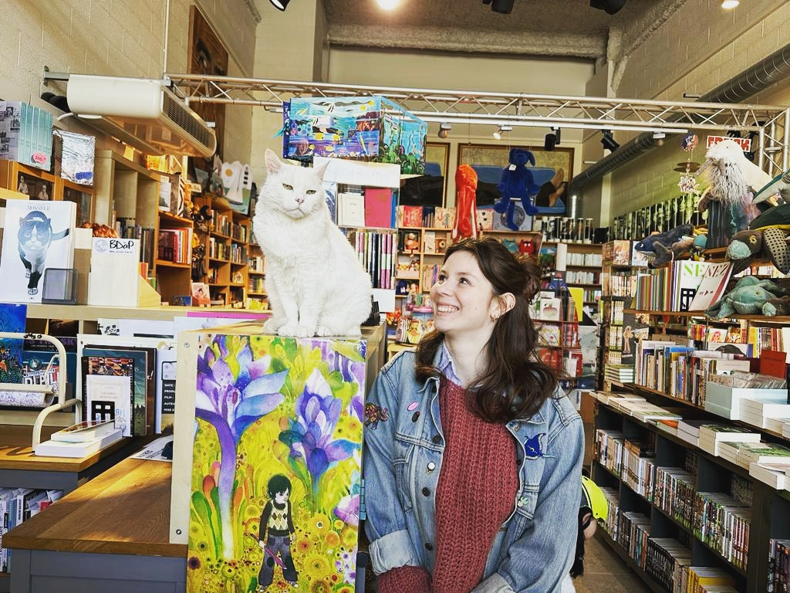

 
  

 </img>

I am a PhD student in applied statistics at LPSM (https://www.lpsm.paris/), MIA Paris Saclay(https://mia-ps.inrae.fr/) and Tour du Valat (https://tourduvalat.org/).

I am working on inferring the presence and abundance of rare waterbirds species from scarce data.

## Contact information

- <i class="fas fa-map-marker"></i> 
Bureau 15-16 204, Jussieu

- <i class="fa-solid fa-envelope"></i> 
LPSM, Sorbonne Université  
  4 place Jussieu,  
  75005 Paris 

- <i class="fa fa-at"></i> <a href="mailto:barbara.bricout@sorbonne-universite.fr
">barbara [dot] bricout  [at] sorbonne-universite [dot] fr</a>

 

 

    
*Last update on `r format(Sys.time(), '%d/%m/%y')` *

